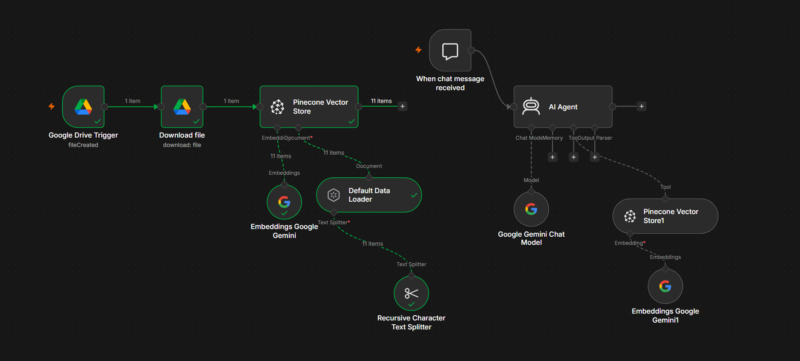

# RAKNO FAQ RAG Chatbot

**Automated Retrieval-Augmented Generation system that turns FAQ documents into an intelligent, grounded chatbot — built entirely with n8n.**

New PDF files dropped into a Google Drive folder are automatically indexed. Users can then chat and receive answers grounded in the official FAQ content.

---

## Demo

| Chat Interface | n8n Workflow Canvas |
|---------------|---------------------|
|  |  |

> Replace the placeholders above with your actual screenshots / GIF.

---

## Problem

Support teams and customers waste time searching through long FAQ documents. Answers are often buried, inconsistent, or outdated. Manual searching does not scale.

## Solution

This system continuously watches a Google Drive folder for new FAQ PDFs, automatically chunks and embeds them into a vector database, and exposes an AI Agent that can retrieve relevant information and generate accurate answers.

---

## Architecture

---

## Key Features

- **Fully automatic ingestion** — Drop a PDF in Google Drive and it gets indexed without any manual steps
- **Agent-style RAG** — The AI Agent decides when to query the knowledge base (tool-calling pattern)
- **Source-aware answers** — Responses are grounded in the FAQ content stored in Pinecone
- **Namespace isolation** — Uses a dedicated Pinecone namespace (`RAKNO`) for clean separation
- **Low-code implementation** — Entire pipeline built visually in n8n (easy to understand and modify)

---

## Tech Stack

| Layer              | Technology                          |
|--------------------|-------------------------------------|
| Orchestration      | n8n                                 |
| Document Source    | Google Drive                        |
| Document Loader    | PDF Loader                          |
| Text Splitting     | Recursive Character Text Splitter  |
| Embeddings         | Google Gemini                       |
| Vector Database    | Pinecone                            |
| LLM                | Google Gemini Chat Model            |
| Agent Framework    | n8n AI Agent                        |
| Trigger            | Chat Trigger + Google Drive Trigger |

---

## Repository Structure

---

## How to Import & Run

### Prerequisites
- An n8n instance (Cloud or self-hosted)
- Google account with Drive access
- Google Gemini API key
- Pinecone account + index

### Steps

1. **Import the workflow**
   - Open n8n → Workflows → Import from File
   - Select `workflow/rakno-faq-rag-pipeline.json`

2. **Create the required credentials**
   - Google Drive OAuth2
   - Google Gemini (PaLM) API
   - Pinecone API

3. **Configure the nodes**
   - **Google Drive Trigger** → Select the folder that contains your FAQ PDFs
   - **Pinecone Vector Store** nodes → Select your index (`rakno1` or create a new one) and set the namespace to `RAKNO`
   - Attach the credentials you created to the relevant nodes

4. **Activate the workflow**

5. **Test**
   - Upload a PDF to the watched Google Drive folder
   - Open the Chat interface and ask questions about the FAQ content

---

## Design Decisions

| Decision | Why |
|---------|-----|
| Agent + Tool pattern instead of fixed chain | Gives the model flexibility to decide when retrieval is needed |
| Recursive Character Text Splitter | Better preserves semantic meaning compared to fixed-size splitting |
| Dedicated Pinecone namespace | Clean isolation of RAKNO data from other projects |
| Google Drive as source of truth | Non-technical team members can update knowledge just by uploading files |
| Gemini for both embeddings and chat | Consistent ecosystem and simplified credential management |

---

## Limitations

- Currently supports **PDF** documents only
- No explicit citation display in the final answer (can be added)
- No evaluation metrics or test set included yet
- Relies on external services (Gemini + Pinecone) — costs apply at scale
- Chat history / memory is not implemented

---

## Future Improvements

- [ ] Add source citations in the response
- [ ] Support additional file types (DOCX, TXT, Markdown)
- [ ] Implement hybrid search (keyword + semantic)
- [ ] Add re-ranking step
- [ ] Create a simple evaluation set + metrics (Recall, Faithfulness, Latency)
- [ ] Add conversation memory
- [ ] Expose the chatbot via a public web interface (Streamlit / custom frontend)

---

## License

This project is licensed under the MIT License — see the [LICENSE](LICENSE) file for details.

---

**Built with n8n • Powered by Google Gemini & Pinecone**